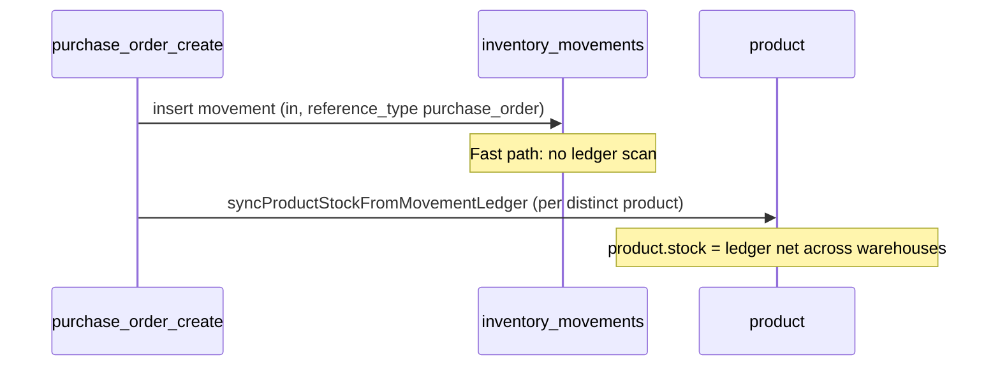

# Stock & inventory management

This document describes how stock is tracked and updated in the Node.js CRUD Generator API **as implemented today**. It is the operational guide for developers working on purchase, sales, returns, adjustments, and inventory APIs.

> **Related (older / alternate docs):** `docs/warehouse-inventory-usage.md` describes an embedded `warehouse_inventory` array on products. The **live path** for warehouse stock is the **`inventory_movements` ledger** plus **`product.stock`**. The `warehouse_inventory` Mongoose model file is currently commented out.

---

## 1. Core concepts

### 1.1 Two layers of quantity

| Layer | Collection / field | Meaning |
|--------|-------------------|---------|
| **Warehouse ledger** | `inventory_movements` | Append-only style log: each row is `in` or `out` for a `product_id` + `warehouse_id` + `company_id`. On-hand at a warehouse = sum(`in`) − sum(`out`) for active rows. |
| **Product total** | `product.stock` | Single number on the product document (company-scoped). Used for listings, POS, and low-stock alerts. |

Warehouse-level truth is derived from the ledger. `product.stock` is either **synced from the ledger** or **adjusted directly** when lines have no warehouse (see §3).

### 1.2 Movement row shape (`models/inventory_movements.js`)

Important fields:

- `movement_type`: `"in"` (stock in) or `"out"` (stock out)
- `product_id`, `warehouse_id`, `company_id`
- `quantity`, `unit_cost`, `total_cost`
- `reference_type`, `reference_id`, `reference_name` — link back to PO, order, return, adjustment, transfer, etc.
- `status`: `"active"` / `"inactive"`, `deletedAt` for soft delete

Active ledger rows match:

```text
status: "active", deletedAt: null, warehouse_id present
```

Helpers live in `controllers/inventory_movements.js`:

- `buildActiveMovementLedgerMatch()` — filter for aggregations
- `aggregateNetQtyByWarehouse()` — per-warehouse `qty_in`, `qty_out`, `net_qty`
- `getLedgerNetQtyForWarehouse()` — net qty for one warehouse
- `syncProductStockFromMovementLedger()` — set `product.stock` from ledger totals

### 1.3 Central entry point

Two entry points:

| Function | Used by | Behavior |
|----------|---------|----------|
| **`insertInventoryMovementRecord(req, session)`** | PO, PR | Single `inventory_movements` insert only |
| **`runInventoryMovementTxnBody(req, session)`** | Orders, adjustments, manual save, stock transfer | Ledger reads, stock check on `out`, wholesale on `in`, audit log |

PO/PR call `insertInventoryMovementRecord` directly (not `runInventoryMovementTxnBody`). Stock updates run afterward in the PO/PR controller via `warehouse_inventory` (§3).

---

## 2. How on-hand is calculated

### Per warehouse

```text
net_qty = SUM(quantity WHERE movement_type = 'in')
        - SUM(quantity WHERE movement_type = 'out')
```

(Only active, non-deleted rows for that `company_id`, `product_id`, and optionally `warehouse_id`.)

### Company-wide product total (sync)

`syncProductStockFromMovementLedger()` aggregates **all warehouses** for the product, sums net qty, and writes:

```text
product.stock = max(0, total_in - total_out)
```

API: `GET /api/inventory_movements/stock-by-product/:product_id` (same logic as the sync helper).

---

## 3. Purchase order (stock in)

**Controllers:** `controllers/purchase_order.js`  
**Routes:** `POST /api/purchase_order/purchase_order_create`, `PATCH /api/purchase_order/purchase_order_update/:id`

### Create flow (per line with `warehouse_id`)



1. Insert `purchase_order` header + `purchase_order_item` rows.
2. For each line with valid `warehouse_id`: post **`movement_type: "in"`** with `reference_type: "purchase_order"`.
3. **`reconcileProductStockAfterPoCreate`**:
   - Lines **with** warehouse → `syncProductStockFromMovementLedger` per product.
   - Lines **without** warehouse → `incrementProductStockForPoLine` (adds qty directly to `product.stock`).

### Update flow (lines replaced)

1. Soft-delete GL transactions and prior `inventory_movements` for that PO (`reference_type: "purchase_order"`).
2. Delete and re-insert `purchase_order_item` rows.
3. Post new `in` movements per warehouse line.
4. `syncProductStockFromMovementLedger` for affected products.

### Header flag

`purchase_order.stock_update` (`yes` / `no`) exists on the model; stock is still updated when the create/update pipeline runs with warehouse lines unless you add separate gating in the future.

---

## 4. Purchase return (stock out)

**Controllers:** `controllers/purchase_return.js`  
**Routes:** `POST /api/purchase_return/purchase_return_create`, etc.

Mirror of PO with opposite direction:

1. Insert **`movement_type: "out"`**, `reference_type: "purchase_return"` (fast path — no availability check).
2. **`reconcileProductStockAfterPrCreate`**:
   - With warehouse → ledger sync (lowers `product.stock` from net ledger).
   - Without warehouse → `decrementProductStockForReturnLine` (subtract from `product.stock`, fails if insufficient).

---

## 5. Sales order (stock out)

**Controllers:** `controllers/order.js`  
**Uses full** `runInventoryMovementTxnBody` path.

Per order line (typical):

1. **`decrementProductStockForOrderLine`** — updates `product.stock` first; fails if not enough.
2. **`resolveWarehouseForOutboundLine`** — picks warehouse (line `warehouse_id` or company default) with enough **ledger** qty.
3. **`movement_type: "out"`**, `reference_type: "order"` — full path enforces `lineQty <= qty_in_stock` for that warehouse.
4. Stock alerts via `evaluateProductStockAlert` after create.

Orders therefore enforce availability on both **product.stock** and **warehouse ledger**.

---

## 6. Adjustments

**Controllers:** `controllers/adjustment.js`

- Type **add** → `movement_type: "in"`, `reference_type: "adjustment"`.
- Type **subtract** → `movement_type: "out"` (full path, stock check).

Uses the full movement helper (not the purchase fast path).

---

## 7. Stock transfer (warehouse to warehouse)

**Controller:** `stockTransfer` in `controllers/inventory_movements.js`  
**Route:** POST stock transfer endpoint (see `routes/api.js`)

No separate transfer table for stock effect:

1. Validate source warehouse has enough ledger qty.
2. Insert **out** from source warehouse.
3. Insert **in** to destination warehouse.
4. Both rows share `reference_type: "stock_transfer"` and a common `reference_id`.

Then callers may sync `product.stock` if needed.

---

## 8. Manual inventory API

**Route:** `POST /api/inventory_movements/save` (and related CRUD)

Uses the **full** `runInventoryMovementTxnBody`:

- `out`: checks available qty; may aggregate all warehouses for error details.
- `in`: may recalculate weighted average and update `product.wholesale_price`.

---

## 9. Low-stock alerts

**Controller:** `controllers/alerts.js` — `evaluateProductStockAlert`

Called after PO/PR create and order flows when stock changes. Compares **on-hand** (usually `product.stock` after sync) to `product.alert_qty` and creates/updates `alerts` rows.

---

## 10. Legacy / secondary: `stock_movements`

**Model:** `models/stock_movement.js`  
**Controller:** `controllers/stock_movement.js`

Older polymorphic movement table (`source_type`: `purchase_order_item`, `order_item`, `adjustment`, `manual`) with `direction` in/out. Some code paths still reference `applyWarehouseInventoryDelta` for a **`warehouse_inventory`** collection, but that model is **commented out** in `models/warehouse_inventory.js`.

**New features should use `inventory_movements`**, not `stock_movements`, unless you are maintaining legacy integrations.

---

## 11. Line items and `warehouse_id`

`purchase_order_item` / `purchase_return_item` store `warehouse_id` (ref name `warehouse_inventories` in schema — historical; movements use `warehouse` ref on the movement document).

| Line has `warehouse_id` | Stock effect |
|-------------------------|--------------|
| Yes | Ledger `in`/`out` + sync `product.stock` from ledger |
| No | Direct increment/decrement on `product.stock` only (no movement row) |

---

## 12. Transactions and rollback

PO, PR, order, and movement save paths use MongoDB `withTransaction` when the deployment supports it (replica set / Atlas). On standalone `mongod`, the same steps retry **without** a session (see `utils/mongoTransactionSupport.js`).

On failure, controllers call `logRollbackFailure` and return rollback messages. PO/PR update soft-delete old movements before inserting replacements to avoid double-counting.

---

## 13. Quick reference — files

| Topic | File |
|--------|------|
| Ledger model | `models/inventory_movements.js` |
| Movement + sync + transfer | `controllers/inventory_movements.js` |
| Purchase in | `controllers/purchase_order.js` |
| Purchase return out | `controllers/purchase_return.js` |
| Sales out | `controllers/order.js` |
| Adjustments | `controllers/adjustment.js` |
| Alerts | `controllers/alerts.js` |
| Product stock field | `models/product.js` |
| API routes | `routes/api.js` |

---

## 14. Design summary

```text
                    ┌─────────────────────────┐
                    │   inventory_movements    │  ← warehouse-level ledger (in/out)
                    │   (source of truth)      │
                    └───────────┬─────────────┘
                                │ aggregate net
                                ▼
                    ┌─────────────────────────┐
                    │      product.stock       │  ← company product total + alerts
                    └─────────────────────────┘

Business documents (PO, order, return, adjustment)
    → post movements (fast or full path)
    → sync or bump product.stock
    → optional alerts
```

**Purchase (`purchase_order` / `purchase_return`):** insert movements without pre-checking warehouse qty; reconcile `product.stock` after.  
**Sales (`order`):** check stock before sale; post `out` movements with full ledger validation.  
**Adjustments / manual / transfer:** full movement rules unless `reference_type` is purchase (fast path only).

---

*Last aligned with codebase: `insertInventoryMovementRecord` for PO/PR; `warehouse_inventory` upsert in purchase controllers.*
