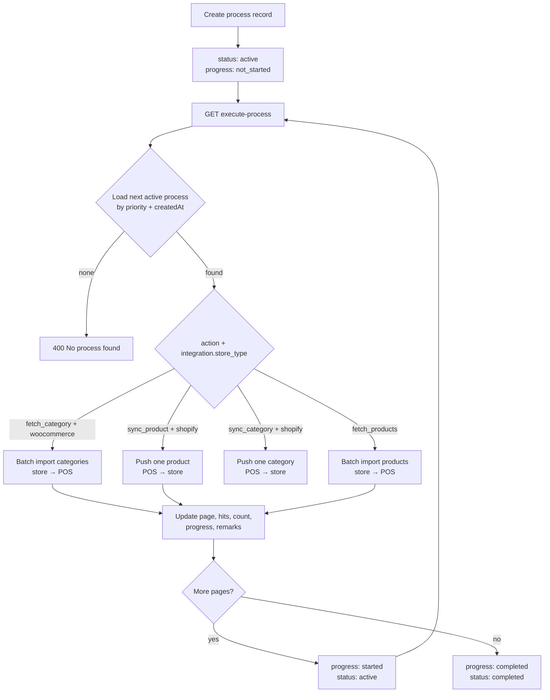

# Process System — How It Works

This document describes the **Process queue**: background-style jobs that connect your POS database with external stores (WooCommerce, Shopify, etc.) through a single API entry point.

---

## Overview

1. You **insert a process record** in Admin (or via API) with an **action** (`sync_product`, `sync_category`, `fetch_products`, etc.) and link it to an **integration** (which defines `store_type`: WooCommerce or Shopify).
2. You call **`GET /api/process/execute-process`** (with auth).
3. The server loads the **next active process** for your company, reads integration credentials, runs the matching handler, and **updates the process row** (`progress`, `status`, `page`, `hits`, `count`, `remarks`).

Each URL hit processes **one batch** (controlled by `limit`). Call the URL again until `progress` is `completed`.

**Base path on production:** `/pos_admin/api/process/execute-process`

---

## Architecture



---

## Process record fields

| Field | Purpose |
|--------|---------|
| `integration_id` | Links to Integration (`url`, `key`, `secret`, `token`, **`store_type`**) |
| `product_id` | Required for **push** actions (`sync_product`) — one POS product |
| `category_id` | Optional for **push** one category to store; not used for **batch import** |
| `action` | Job type (see below) |
| `limit` | Batch size per `execute-process` hit (e.g. `5` = five categories per call) |
| `page` | Current page sent to the store API (starts at `1`, increments after each batch) |
| `offset` | Alternative skip cursor (use `page` **or** `offset`, not both, per handler) |
| `count` | Running total of items processed (inserted + skipped) |
| `hits` | Number of times `execute-process` has run for this job |
| `priority` | Lower number runs first when multiple processes are `active` |
| `progress` | `not_started` → `started` → `completed` (or `failed`) |
| `status` | Queue control: `active` while runnable; `completed` / `failed` when done |
| `remarks` | Human-readable log of last batch result |
| `company_id` | Tenant that owns the job; imported rows use this company |

**Store type** is not stored on the process row. It comes from the linked **Integration** record:

- `woocommerce` — WooCommerce REST API (`url`, consumer key, consumer secret)
- `shopify` — Shopify Admin API (`url`, key, secret, access token)

---

## Action types and direction

| Action | Direction | Batch? | Needs |
|--------|-----------|--------|--------|
| `fetch_products` | Store → POS | Yes (`limit`, `page`) | `integration_id` |
| `fetch_category` | Store → POS | Yes (`limit`, `page` / `offset`) | `integration_id`, `company_id` |
| `sync_category` | POS → Store | No (one category) | `integration_id`, `category_id` |
| `sync_product` | POS → Store | No (one product) | `integration_id`, `product_id` |
| `delete_product` / `delete_category` | POS → Store | No | TBD |

> **Naming note:** Importing categories **from** the website **into** your DB is a **fetch/import** job. Exporting a POS category **to** the store is a **push/sync-out** job. Use the table above to pick the right action when creating a record.

---

## Example: Import categories from WooCommerce (batch)

This matches the workflow you described: fetch categories from the website, compare by name, skip duplicates, insert new ones into your DB, five at a time.

### 1. Create the integration

Admin → **Integration** — set `store_type` = `woocommerce`, plus `url`, `key`, `secret`.

### 2. Create the process record

| Field | Example value |
|--------|----------------|
| `action` | `fetch_category` *(or batch import handler for categories)* |
| `integration_id` | Your WooCommerce integration |
| `limit` | `5` |
| `page` | `1` |
| `count` | `0` |
| `hits` | `0` |
| `progress` | `not_started` |
| `status` | `active` |
| `priority` | `100` |

You do **not** need `category_id` for import jobs.

### 3. Call execute-process

```http
GET /pos_admin/api/process/execute-process
Authorization: Bearer <token>
```

Optional query params:

| Param | Use |
|--------|-----|
| `process_id` | Run a specific process instead of “next active” |
| `category_id` | Only for single-category **push** jobs |

### 4. What happens on each hit (intended behaviour)

```text
Hit 1 (page=1, limit=5)
  → Load integration key + secret
  → GET store categories page 1 (5 items)
  → For each remote category:
       - If name already exists in POS (same company) → skip
       - Else → INSERT into Category collection
  → count += processed, hits += 1, page → 2, progress → started

Hit 2 (page=2, limit=5)
  → Next 5 categories from store
  → Same compare / insert / skip logic
  → page → 3

…

Last hit (store returns fewer than limit items)
  → Finish remaining rows
  → progress → completed
  → status → completed
  → remarks → e.g. "Imported 23 categories, skipped 7 duplicates"
```

### 5. Sample JSON responses

**Batch in progress:**

```json
{
  "success": true,
  "message": "Batch complete: 5 fetched, 3 inserted, 2 skipped",
  "data": {
    "process_id": "...",
    "page": 2,
    "hits": 1,
    "count": 5,
    "progress": "started",
    "status": "active"
  }
}
```

**Job finished:**

```json
{
  "success": true,
  "message": "Category import completed",
  "data": {
    "process_id": "...",
    "progress": "completed",
    "status": "completed",
    "count": 23,
    "hits": 5
  }
}
```

---

## Example: Push one product to Shopify (`sync_product`)

| Field | Value |
|--------|--------|
| `action` | `sync_product` |
| `integration_id` | Shopify integration |
| `product_id` | POS product to push |
| `status` | `active` |

One `execute-process` call pushes (or skips if SKU exists). See [product_sync_wordprss.md](./product_sync_wordprss.md) and [sync_product_to_shopify.md](./sync_product_to_shopify.md).

---

## Progress and status state machine

```text
progress:  not_started ──first hit──► started ──last batch──► completed
                                              └──error──────► failed

status:    active (runnable) ──success done──► completed
           active ──error────────────────────► failed
           inactive (paused, will not run)
```

| After each hit | Typical updates |
|----------------|-----------------|
| First batch | `progress: started`, `hits += 1`, `page += 1`, `count += batch_total` |
| Middle batch | Same, `status` stays `active` |
| Final batch | `progress: completed`, `status: completed` |
| API / validation error | `progress: failed`, `status: failed`, `remarks` = error detail |

---

## How the queue picks a job

`loadActiveProcess()` selects **one** document from the **global** active queue (all companies):

```text
filter:  status = "active", deletedAt null/missing
sort:    priority ASC, createdAt ASC
populate: integration_id, product_id, category_id, company_id
```

Optional query params:

| Param | Effect |
|--------|--------|
| `process_id` | Run that specific row only |
| `company_id` | Limit queue to one company (optional) |

Lower `priority` runs first. Each hit runs **one** process (one batch). Call again for the next job.

---

## Authentication

`execute-process` is on the API router. Send either:

- **Bearer token** (from `POST /api/user/login`), or  
- Valid **admin session cookie**

Requests require a valid **Bearer token** (or admin session for admin routes). The queue is **global** by default — not limited to the logged-in user's `company_id`. Imported categories are saved under each process row's `company_id`.

Optional: `?company_id=` scopes the queue to one tenant.

---

## Admin UI

Admin → **Process** — create/edit queue rows.

Required dropdowns: **Integration**, **Action**, **Status**. For push jobs also set **Product** or **Category**. Set **Limit** and **Page** for batch import jobs.

---

## Implementation status (current codebase)

| Feature | Status |
|---------|--------|
| `GET /api/process/execute-process` | Implemented |
| Queue loader (`priority`, `company_id`, `process_id`) | Implemented |
| `fetch_category` → WooCommerce / Shopify (batch import) | Implemented |
| `sync_product` → WooCommerce / Shopify | Implemented |
| `sync_category` → push one category to store | Implemented |
| `fetch_products` batch import | Stub / commented in controller |
| `hits`, `progress` updates on batch import | Implemented |
| Admin fields for `hits`, `progress`, `fetch_category` | Implemented |

**Pagination notes:** WooCommerce uses `page` + `limit`. Shopify uses `limit` + `offset` (stores the last Shopify collection `id` as `since_id` for the next batch).

---

## Quick reference — URLs

| Environment | Execute process |
|-------------|-----------------|
| Local | `http://localhost:8000/api/process/execute-process` |
| Production | `https://testv3.websitedemolynk.com/pos_admin/api/process/execute-process` |

---

## Related files

| File | Role |
|------|------|
| `models/process.js` | Process schema |
| `models/integration.js` | Store credentials + `store_type` |
| `controllers/process.js` | Queue loader + `execute_process` router |
| `controllers/woocommerceProcess.js` | WooCommerce fetch/sync handlers |
| `controllers/shopifyProcess.js` | Shopify fetch/sync handlers |
| `utils/processHelpers.js` | Shared batch helpers, dispatch, process status updates |
| `routes/api.js` | Route registration |
| `routes/admin.js` | Admin CRUD for process records |
